# 06 · Mapa del proyecto

Este documento es el mapa vivo de LUCIA: dónde vive cada cosa, cómo se conecta y
qué requerimiento o decisión la justifica. Sirve para dos lectores distintos:

- **Personas**, para orientarse rápido sin leer todo el repo antes de tocar algo.
- **IA (agentes de Claude Code)**, como referencia de consulta antes de un cambio:
  qué módulo toca, con qué otros habla, y qué doc detallada corresponde.

Lo mantiene actualizado el agente **`mapeador`**, y es un **cruce** del trabajo de
los demás agentes de calidad del proyecto: toma los nombres que fija
`bautizador`, la estructura que deja `minimalista` tras simplificar, y los
RF/RNF/ADR que registra `documentador`, y los refleja aquí. No repite la
narrativa de [03-arquitectura.md](03-arquitectura.md), de
[02-requerimientos.md](02-requerimientos.md) ni de
[07-coherencia-ui.md](07-coherencia-ui.md) (criterios de interfaz, del agente
`coherencia-ui`); apunta a ellas.

> Si un diagrama de aquí contradice el código actual, el código manda: es señal
> de que el mapeador necesita pasar. Ver [CLAUDE.md](../CLAUDE.md).

## 1 · Flujo general

```mermaid
flowchart TB
    subgraph Cliente
        WEB["apps/web<br/>React + Vite"]
        TREE["features/board/tree.ts<br/>fromPgn · toPgn (chess.js)<br/>PGN ↔ árbol, sin backend (RF-6.6/6.7)<br/>matchAnalyzedLine: hasta dónde vale<br/>lo analizado tras seguir editando (RF-6.9)"]
        EDITOR["features/board/position.ts + PositionEditor.tsx<br/>editor de posición pieza a pieza (RF-6.1)<br/>toFen · fromFen · positionError, sin backend"]
    end

    subgraph Servidor["apps/api (FastAPI)"]
        ROUTERS["routers/<br/>sync · pgn_import · games · analysis<br/>stats · engines · boards · repertoire"]
        WORKER["worker/<br/>cola de análisis en background<br/>_load_pgn_to_analyze: partida o tablero"]
        SVC_ANALYSIS["services/analysis.py<br/>run_analysis(pgn) · analyze_position<br/>+ lectura de alternativas guardadas"]
        SVC_BOARDS["services/boards.py<br/>historial lineal de versiones<br/>record_version · undo/redo (RF-6.8)"]
        SVC_STATS["services/stats.py<br/>agrega en SQL y reparte por mes<br/>(tendencias RF-3.7)"]
        SVC_INSIGHTS["services/insights.py<br/>lee el análisis guardado<br/>latest_analysis_ids: solo los que tienen game_id"]
        SVC_OWN["services/own_games.py<br/>publica el tablero como partida<br/>del historial (RF-6.5, ADR-0014)"]
        SVC_SYNC["services/chesscom_sync.py<br/>importa partidas y les pone apertura"]
        SVC_PGN["services/pgn_import.py<br/>archivo PGN → las mismas filas<br/>(platform=manual, RF-1.5)"]
        SVC_EXPORT["services/pgn_export.py<br/>análisis guardado → PGN anotado<br/>(comentarios y variantes, RF-5.5)"]
        SVC_GAMES["services/games.py<br/>de qué color jugó el usuario<br/>y qué le pasó (expresiones SQL)"]
        SVC_REP["services/repertoire.py<br/>compara con la caché ·<br/>refresh_repertoire (la red)"]
    end

    subgraph Nucleo["packages/core"]
        BRIDGE["engine/EngineBridge<br/>puente UCI"]
        ANALYSIS["analysis/GameAnalyzer"]
        CLASS["classification/MoveClassifier"]
        ACC["accuracy/"]
        INSIGHTS["insights/<br/>momentos críticos · tipos de error<br/>presión de reloj · salida de apertura<br/>calidad de un tramo y tendencia (RF-3.7)"]
        OPENINGS["openings/<br/>tabla ECO versionada (ADR-0009)<br/>identify_opening · opening_of_pgn"]
    end

    CHESSCOM["packages/chesscom<br/>ChessComClient"]
    LICHESS["packages/lichess<br/>LichessExplorerClient"]
    DB[("SQLite<br/>data/lucia.db<br/>+ explorer_positions (caché EPD)")]
    ENGINES["engines/bin<br/>stockfish · lc0"]
    API_CHESSCOM["api.chess.com<br/>(externo)"]
    API_LICHESS["explorer.lichess.org<br/>(externo, con token)"]

    WEB -- "REST /api" --> ROUTERS
    WEB -- "WebSocket /ws" --> ROUTERS
    ROUTERS --> WORKER
    ROUTERS --> DB
    ROUTERS -- "GET /games (filtros RF-5.3)" --> SVC_GAMES
    ROUTERS -- "GET /stats" --> SVC_STATS
    ROUTERS -- "GET /analysis/{id}" --> SVC_INSIGHTS
    SVC_STATS -- "lado del jugador en SQL" --> SVC_GAMES
    SVC_STATS -- "jugadas ya analizadas" --> SVC_INSIGHTS
    SVC_STATS -- "games: de qué mes es cada partida<br/>y con qué rating cerró (RF-3.7)" --> DB
    SVC_INSIGHTS --> DB
    SVC_INSIGHTS -- "sin motor (ADR-0008)" --> INSIGHTS
    ROUTERS -- "POST /analysis/position<br/>(síncrono, sin cola)" --> SVC_ANALYSIS
    ROUTERS -- "PUT /boards/{id} · POST /boards/{id}/undo · /redo<br/>(RF-6.8)" --> SVC_BOARDS
    SVC_BOARDS -- "board_versions · boards.current_version_id<br/>(ADR-0012)" --> DB
    ROUTERS -- "PUT · DELETE /boards/{id}/own-game<br/>(RF-6.5)" --> SVC_OWN
    SVC_OWN -- "get_or_create_player ·<br/>SIDE_RESULTS_BY_PGN_RESULT (RF-1.5)" --> SVC_PGN
    SVC_OWN -- "opening_of_pgn → games.opening_eco/name" --> OPENINGS
    SVC_OWN -- "games (platform=board) · boards.own_game_id ·<br/>analyses.game_id si lo analizado sigue valiendo" --> DB
    WORKER -- "run_analysis(session, analysis, pgn)<br/>PGN de la partida o de analyzed_pgn (RF-6.9)" --> SVC_ANALYSIS
    SVC_ANALYSIS --> BRIDGE
    SVC_ANALYSIS --> ANALYSIS
    ANALYSIS --> CLASS
    ANALYSIS --> ACC
    ANALYSIS -- "hasta dónde llega la teoría<br/>(clasificación book, RF-2.2)" --> OPENINGS
    BRIDGE -- "UCI (stdin/stdout)" --> ENGINES
    ROUTERS -- "POST /sync" --> SVC_SYNC
    SVC_SYNC --> CHESSCOM
    SVC_SYNC -- "opening_of_pgn → games.opening_eco/name" --> OPENINGS
    SVC_SYNC --> DB
    ROUTERS -- "POST /import/pgn (multipart)" --> SVC_PGN
    SVC_PGN -- "parse_move_clocks (sin red)" --> CHESSCOM
    SVC_PGN -- "opening_of_pgn → games.opening_eco/name" --> OPENINGS
    SVC_PGN -- "mismas tablas games/players<br/>(ADR-0011)" --> DB
    WEB -- "PGN pegado (tablero) ·<br/>GET /analysis/{id}/pgn o game.pgn (visor)" --> TREE
    EDITOR -- "FEN montado → campo 'FEN o PGN' de BoardsPage<br/>(no crea el tablero: lo sigue haciendo parseSource)" --> WEB
    TREE -- "POST /boards (visor) ·<br/>PUT /boards/{id} (title · root_fen · tree_json) ·<br/>POST /boards/{id}/analysis (toPgn de la principal, RF-6.9)" --> ROUTERS
    ROUTERS -- "GET /analysis/{id}/pgn<br/>(solo status=done; descarga)" --> SVC_EXPORT
    SVC_EXPORT -- "engine_lines_from_serialized · alternatives_of<br/>(sin motor: todo sale de analyzed_moves)" --> SVC_ANALYSIS
    CHESSCOM -- "HTTPS" --> API_CHESSCOM
    ROUTERS -- "GET /repertoire (sin red)<br/>POST /repertoire/refresh (con red)" --> SVC_REP
    SVC_REP -- "lee partidas y caché;<br/>GET /repertoire se queda aquí" --> DB
    SVC_REP -- "solo refresh_repertoire<br/>(tope por llamada, ADR-0010)" --> LICHESS
    LICHESS -- "HTTPS masters(fen)" --> API_LICHESS
    SVC_ANALYSIS -- "analyzed_moves · position_cache" --> DB
```

Detalle narrativo y modelo de datos completo: [03-arquitectura.md](03-arquitectura.md).

## 2 · Módulos y dependencias

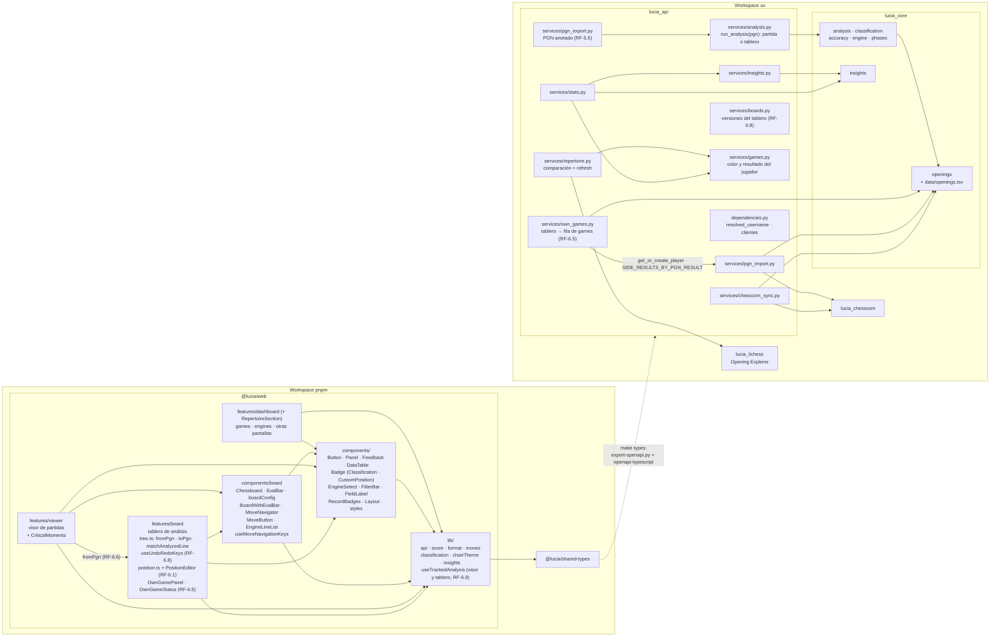

Regla: `lucia_core`, `lucia_chesscom` y `lucia_lichess` no dependen de
`lucia_api` (evita ciclos); `lucia_api` orquesta a los tres. Si un cambio rompe esta dirección, es una señal
para el agente `minimalista`. Se comprobó tras los extractores de patrones:
`lucia_core.insights` solo recibe `MoveContext` ya construidos, no conoce ni la
base de datos ni la API. Se volvió a comprobar con `lucia_core.openings`: la
tabla ECO es un dato del propio núcleo (`openings/data/openings.tsv`,
[ADR-0009](adr/0009-tabla-de-aperturas-versionada.md)) y tanto
`services/chesscom_sync.py` como `analysis/` la usan hacia abajo, sin vuelta.
`routers/stats.py` y `routers/analysis.py` entran por
`services/`, que es quien lee SQLite y traduce a los tipos del núcleo
([ADR-0008](adr/0008-patrones-deducidos-al-leer.md)). Con los filtros de
`GET /games` (RF-5.3) apareció una dependencia más dentro de `lucia_api`:
`routers/games.py` y `services/stats.py` importan las mismas expresiones SQL de
`services/games.py` (`is_white`, `is_black`, `is_player`, `player_side`,
`player_color`, `outcome_of`, `DRAW_RESULTS`) —de qué color jugó el usuario y
qué le pasó—, en vez de repetirlas cada uno. `services/games.py` no depende de
nadie más que del modelo `Game`, así que sigue siendo una sola vía.

Con el repertorio (RF-3.6) entró el segundo cliente externo del workspace,
`packages/lichess` (`lucia_lichess`), hermano de `packages/chesscom`: mismo
sitio en el grafo —lo importa `lucia_api`, no al revés— y misma regla de una
sola vía. La diferencia está dentro de `lucia_api`: solo
`services/repertoire.py::refresh_repertoire` lo usa, mientras
`compare_repertoire` se queda en SQLite ([ADR-0010](adr/0010-repertorio-con-red-y-cacheado.md)).
`services/repertoire.py` reutiliza `is_white` de `services/games.py`, la misma
pieza que ya comparten `routers/games.py` y `services/stats.py`. Y la
resolución del jugador por defecto, que estaba repetida en `routers/stats.py` y
`routers/repertoire.py`, vive ahora en `lucia_api/dependencies.py`
(`resolved_username`).

Con la importación de PGN (RF-1.5) hay un segundo servicio que llena el
historial, `services/pgn_import.py`, y mira hacia los mismos dos sitios que
`services/chesscom_sync.py`: `lucia_core.openings` (`opening_of_pgn`) y
`lucia_chesscom` (`parse_move_clocks`, que es lectura de PGN, no red). Sigue
siendo una sola vía: `lucia_chesscom` no sabe nada de `lucia_api`, y del
importador no cuelga cliente externo alguno —el archivo lo sube el usuario—.
Que las dos vías escriban en las mismas tablas `games`/`players`, con
`platform="manual"` y huecos declarados donde el PGN no dice nada, es
[ADR-0011](adr/0011-pgn-manual-en-la-misma-tabla.md); por eso el visor, el
análisis y las estadísticas no tienen una rama por origen de la partida. El
único punto donde el origen se nota es el vocabulario de resultados: `"draw"`
a secas entró en `DRAW_RESULTS`, que `services/games.py` y `lib/format.ts`
mantienen en paralelo.

Con la exportación a PGN anotado (RF-5.5) hay un servicio más dentro de
`lucia_api`, `services/pgn_export.py`, y su única dependencia interna es
`services/analysis.py` (`engine_lines_from_serialized`, `alternatives_of`):
sigue la dirección que ya existía, no la invierte y no toca el motor ni la
base —recibe el análisis, las jugadas y las alternativas ya cargadas por
`routers/analysis.py::_load_analysis_with_moves`, el mismo cargador que sirve
`GET /analysis/{id}`—. Es simétrico de `services/pgn_import.py` en el nombre y
opuesto en el sentido: uno convierte un archivo en filas, el otro convierte
filas en un archivo.

Dentro de `@lucia/web` la dirección también es de una sola vía: las pantallas
(`features/*`) importan de `components/` —lo compartido entre dos o más de
ellas—, nunca al revés. Las piezas de tablero que usan el visor y el tablero de
análisis viven en `components/board/` —desde RF-10, también `EngineLineList`, la
lista de líneas del motor que comparten los dos—; el resto de lo común (botón,
panel, estados, recetas de clases), en `components/`. Si un componente de
`components/` empieza a importar de un `features/`, es que no era compartido y
su sitio es esa pantalla. La barra de filtros de `GamesPage` y `DashboardPage`
está en `components/FilterBar.tsx` por eso mismo (con la espera de 400 ms al
teclear dentro de `FilterText`, ya no en cada pantalla), y la etiqueta de campo
que comparten esa barra, Sincronizar, `BoardsPage` y `EnginesPage`, en
`components/FieldLabel.tsx`. Sí puede apoyarse en `lib/` —funciones puras y hooks
sin pantalla: `EngineSelect` usa `format.ts`, `ClassificationBadge` usa
`classification.ts`—, que es la capa de abajo de todos. Inventario:
[apps/web/src/components/README.md](../apps/web/src/components/README.md).

Con "Abrir como tablero" (RF-6.6) aparece la primera flecha entre dos
`features/`: `features/viewer/GameViewerPage.tsx` importa `fromPgn` de
`features/board/tree.ts`. Es deliberado y de una sola vía —el tablero no
importa nada del visor—: `tree.ts` es el módulo del árbol de variantes, y leer
un PGN es construir uno; moverlo a `lib/` lo separaría de `toPgn`, `addMove` y
`createRoot`, que son sus inversas y con las que comparte `findOrCreateChild`.
Si un tercer `features/` acabara necesitándolo, entonces sí toca subirlo a una
capa común: sería señal para el agente `minimalista`.

Eso mismo pasó con el análisis en background del tablero (RF-6.9): el hook que
sigue una fila `Analysis` por WebSocket vivía en
`features/viewer/useAnalysisProgress.ts` y, al necesitarlo también el tablero,
subió a `apps/web/src/lib/useTrackedAnalysis.ts` (`useTrackedAnalysis`,
`useElapsedSeconds`); el archivo del visor ya no existe. Es la regla de arriba
aplicada en la otra dirección —dos `features/` que comparten algo sin pantalla
propia van a `lib/`, no se importan entre sí— y deja el visor y el tablero
enseñando el mismo progreso con el mismo código. En el backend, RF-6.8 añade un
servicio más a `lucia_api`, `services/boards.py`, sin dependencias internas: solo
toca los modelos `Board` y `BoardVersion`, y quien lo llama es `routers/boards.py`.
RF-6.9 no añade ninguna flecha nueva: `services/analysis.py::run_analysis` pasó a
recibir el PGN en vez de un `Game`, con lo que dejó de mirar al modelo de partida
y quien decide de dónde sale el texto es `worker/__init__.py::_load_pgn_to_analyze`.

Publicar un tablero como partida propia (RF-6.5) añade un servicio más,
`services/own_games.py`, y su única dependencia interna dentro de `lucia_api`
es `services/pgn_import.py` (`get_or_create_player`,
`SIDE_RESULTS_BY_PGN_RESULT`): reutiliza la misma puerta por la que entra un
PGN de otra fuente (RF-1.5) en vez de abrir una segunda forma de crear un
jugador o de traducir un resultado. Hacia abajo mira a `lucia_core.openings`
(`opening_of_pgn`), igual que las otras dos vías que llenan `games`. No
invierte nada: `services/pgn_import.py` no sabe que existen los tableros, y
`services/stats.py` e `services/insights.py` cuentan la partida publicada
**sin ningún cambio**, porque para ellos es una fila de `games` más con un
`Analysis` que trae `game_id` ([ADR-0014](adr/0014-tablero-propio-publicado-como-partida.md)).
El enlace lo lleva `boards.own_game_id` (FK a `games`, `SET NULL`, migración
`a71c40f5d3e8`), que sustituye al antiguo booleano `boards.is_own_game`; ese
nombre sigue existiendo como propiedad derivada del modelo `Board`
(`own_game_id is not None`), no como columna.

El editor de posición (RF-6.1) tampoco añade ninguna flecha al grafo: son dos
módulos más **dentro** de `features/board` —`position.ts` (lógica pura, sin
React) y `PositionEditor.tsx` (la pantalla)— que miran hacia donde ya miraba el
tablero: `components/board/Chessboard.tsx` y `components/` (`Button`, `Panel`,
`Feedback`, `FieldLabel`, `styles`). No toca `lib/api.ts`, porque no habla con
la API: devuelve el FEN al campo de `BoardsPage.tsx` y quien crea el tablero
sigue siendo `parseSource`. La única dependencia nueva es en el otro sentido y
dentro del mismo módulo: `tree.ts` importa `STANDARD_STARTING_FEN` de
`position.ts` en vez de recalcular `new Chess().fen()`.

## 3 · Flujos principales

Son doce secuencias, agrupadas aquí por lo que hacen —el índice es
la agrupación: cada flujo sigue teniendo su diagrama, porque juntar dos en uno
solo haría un diagrama ilegible—:

- **Llenar el historial**: sincronizar con chess.com (RF-1) · importar un
  archivo PGN (RF-1.5) · publicar un tablero como partida propia (RF-6.5).
  Tres vías, las mismas tablas.
- **Consultar lo guardado**: listar partidas con filtros (RF-5.3).
- **Llamar al motor**: analizar una partida o un tablero (RF-2 / RF-6.9, con
  cola) · analizar una posición en vivo (RF-5.2 / RF-6.2, síncrono).
- **Leer el análisis ya guardado, sin motor**: alternativas por jugada
  (RF-10) · exportar a PGN anotado (RF-5.5) · patrones y tendencias (RF-2.8 ·
  RF-3.2 · RF-3.4 · RF-3.5 · RF-3.7).
- **Contrastar con teoría externa**: repertorio contra maestros (RF-3.6).
- **Llevar un PGN al tablero de análisis** (RF-6.6 · RF-6.7): la única
  secuencia que no pasa por un servicio del backend.
- **Deshacer y rehacer en el tablero** (RF-6.8): el cursor de un historial
  guardado, no una pila en memoria.

### Sincronizar con chess.com (RF-1, implementado)

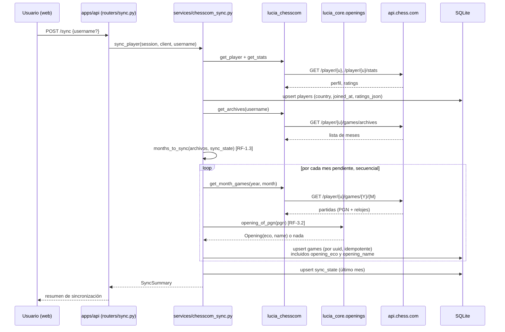

### Importar un archivo PGN (RF-1.5, implementado)

La segunda vía de llenar el historial, junto a `POST /sync`: partidas de otra
fuente —sobre el tablero, lichess, un archivo de torneo— que acaban en las
mismas tablas y de ahí en el visor, el análisis y las estadísticas. El porqué
de cada regla está en el flujo 6 de
[03-arquitectura.md § Flujos principales](03-arquitectura.md) y en
[ADR-0011](adr/0011-pgn-manual-en-la-misma-tabla.md); aquí solo el recorrido.

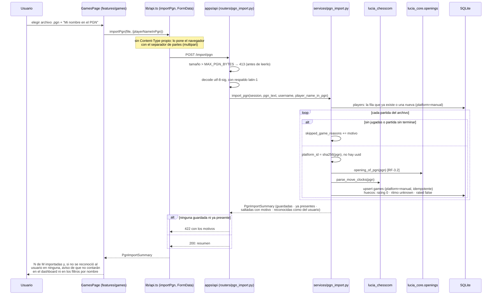

### Listar partidas con filtros (RF-5.3, implementado)

Nueve filtros sobre lo que la sincronización ya guardó, sin llamar al motor.
Las reglas (qué filtro necesita jugador, cómo se leen las fechas) están en
[02-requerimientos.md § RF-5](02-requerimientos.md); aquí solo el recorrido.

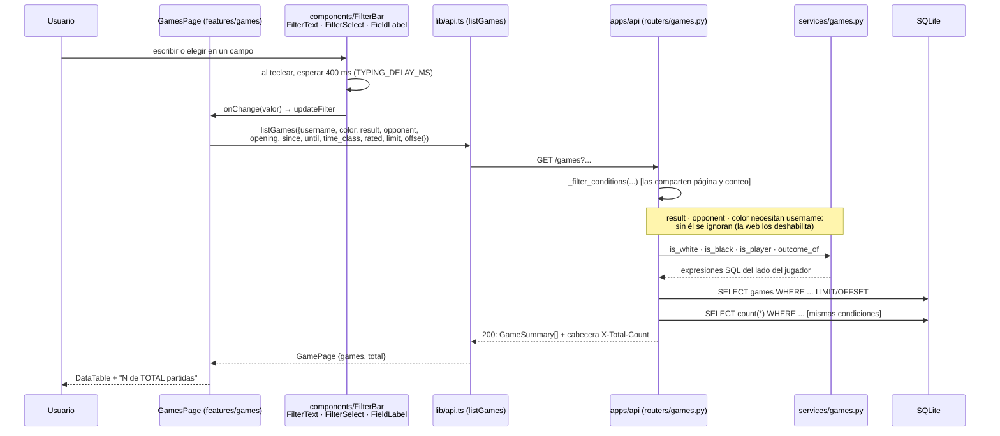

### Analizar una partida o un tablero (RF-2 / RF-6.9, implementado)

Una sola corrida de motor para las dos entradas: la fila `Analysis` cuelga de
`game_id` o de `board_id` y comparte tabla, cola, `analyzed_moves` y WebSocket
de progreso ([ADR-0013](adr/0013-analisis-de-partida-o-de-tablero.md)). Lo
único que las distingue es de dónde sale el PGN, y eso lo resuelve
`AnalysisWorker._load_pgn_to_analyze`.

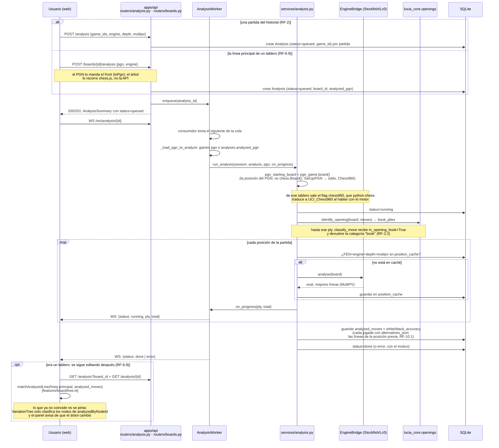

Las dos entradas usan el mismo hook en el cliente,
`lib/useTrackedAnalysis.ts` (`useTrackedAnalysis`, `useElapsedSeconds`), que
es quien abre el WebSocket y recarga al terminar. Un análisis de tablero **no
cuenta en estadísticas ni en patrones** mientras el tablero sea solo un
tanteo: lo deja fuera `services/insights.py::latest_analysis_ids`, que exige
`game_id` no nulo. La excepción es RF-6.5: si el tablero está publicado como
partida propia, el análisis nace ya con `game_id` además de `board_id` y
cuenta por la puerta de siempre (flujo siguiente).

`GET /analysis/{id}` es el respaldo si no hubo WebSocket conectado o se
perdió algún evento (hay una ventana de carrera pequeña y documentada entre
suscribirse y el estado real, ver docstring de `analysis_progress`), y es
también donde se rellenan las alternativas de los análisis anteriores a RF-10,
leyéndolas de `position_cache` con `alternatives_from_cache`
([ADR-0007](adr/0007-alternativas-por-jugada-json-y-cache.md)).

### Analizar una posición en vivo (RF-5.2 / RF-6.2, implementado)

Flujo 3 de [03-arquitectura.md § Flujos principales](03-arquitectura.md): no
hay fila `Analysis` ni cola, la petición es síncrona y el cliente es quien
traduce la evaluación a probabilidad de victoria ([ADR-0006](adr/0006-probabilidad-de-victoria-en-el-cliente.md)).

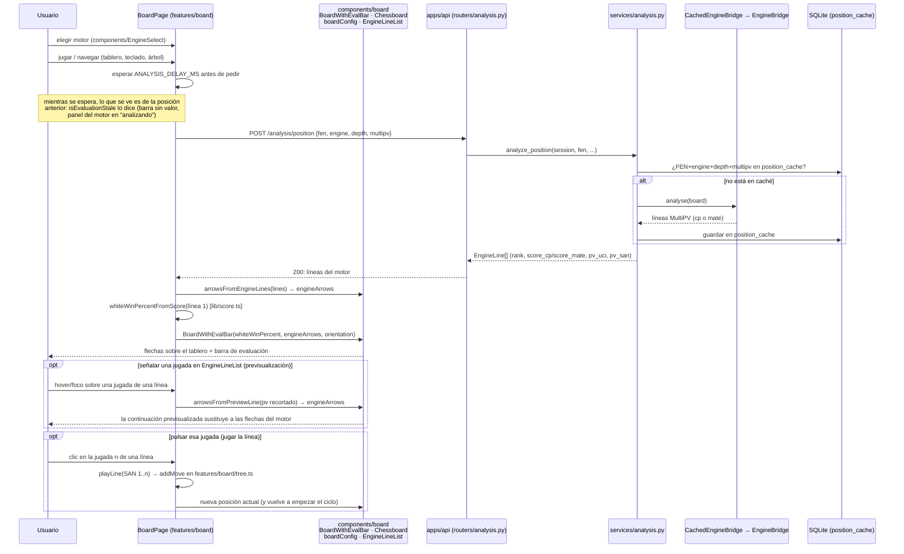

### Ver las alternativas de una jugada guardada (RF-10, implementado)

En el visor la fuente es distinta: no llama al motor, pinta el análisis ya
guardado. Desde RF-10 ese análisis trae todas las líneas de cada posición, así
que el visor dibuja las mismas flechas y la misma lista que el tablero de
análisis sin pedir nada más.

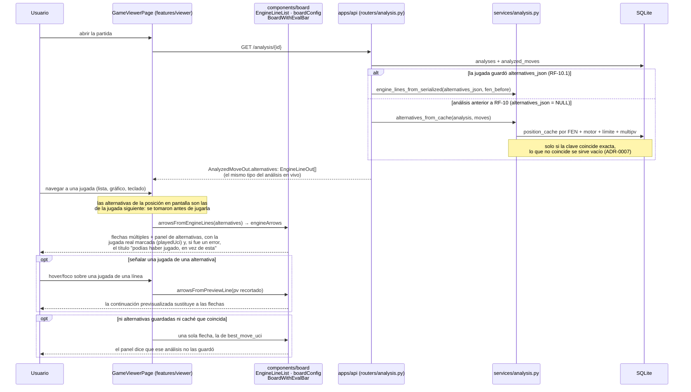

A diferencia del tablero de análisis, aquí pulsar una jugada de una línea solo
la dibuja: no hay `onPlayLine`, porque una partida terminada no se continúa.

### Exportar el análisis a PGN anotado (RF-5.5, implementado)

La otra salida del mismo material que pinta el visor: en vez de dibujarlo,
lo escribe en un archivo que se abre en lichess, ChessBase o SCID. Tampoco
llama al motor. Qué se escribe y por qué está en el flujo 7 de
[03-arquitectura.md § Flujos principales](03-arquitectura.md); aquí solo el
recorrido.

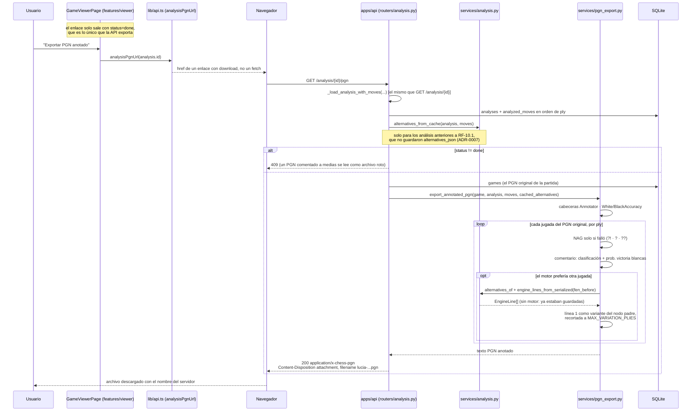

### Llevar un PGN al tablero de análisis (RF-6.6 / RF-6.7, implementado)

La entrada que faltaba frente a `toPgn`: dos pantallas distintas llaman a la
misma función del cliente, `fromPgn`, porque quien decide si una jugada es
legal en su posición es chess.js y no la API —no hay endpoint, tabla ni
migración nuevos—. El porqué de cada regla (por qué importar sustituye en vez
de fundir, por qué la copia nunca es "partida propia") está en el flujo 8 de
[03-arquitectura.md § Flujos principales](03-arquitectura.md) y en
[02-requerimientos.md § RF-6](02-requerimientos.md); aquí solo el recorrido.

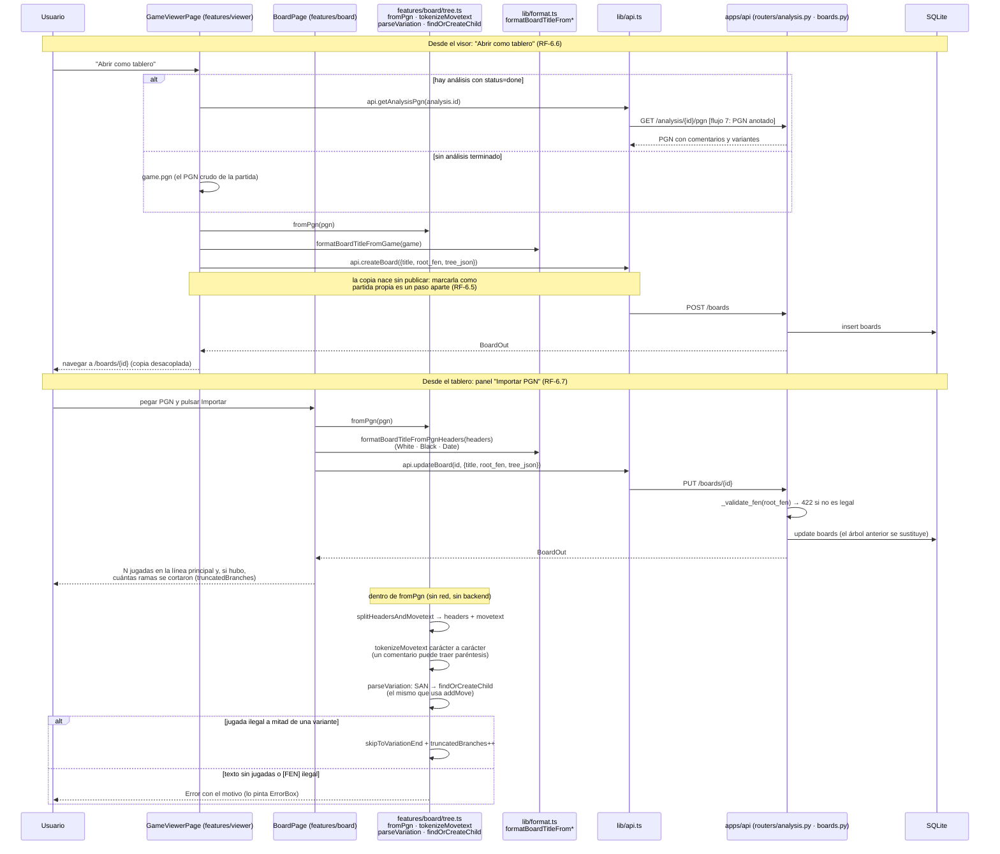

### Deshacer y rehacer en el tablero (RF-6.8, implementado)

El historial no es una pila en memoria: es una lista de versiones guardadas
(`board_versions`) con un cursor (`boards.current_version_id`), así que
sobrevive a recargar la página y a cerrar la aplicación
([ADR-0012](adr/0012-historial-de-tablero-lineal-y-persistido.md)). Por qué
solo anotan versión las escrituras que cambian el árbol, y por qué hay que
vaciar antes el autoguardado, está en el flujo 9 de
[03-arquitectura.md § Flujos principales](03-arquitectura.md); aquí solo el
recorrido.

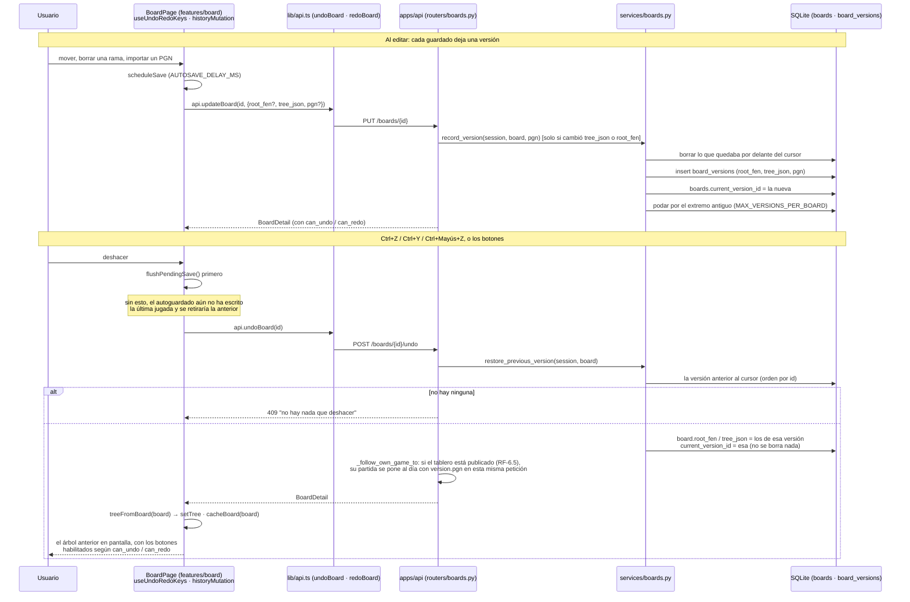

Rehacer es el mismo recorrido con `restore_next_version` y
`POST /boards/{id}/redo`.

### Publicar un tablero como partida propia (RF-6.5, implementado)

La tercera vía de llenar el historial, junto a `POST /sync` y
`POST /import/pgn`: un tablero que el usuario marca como partida suya se
guarda **además** como una fila de `games`, así que el dashboard, los
patrones, las tendencias y los filtros del listado lo cuentan sin que ninguna
de sus consultas tenga que aprender qué es un tablero
([ADR-0014](adr/0014-tablero-propio-publicado-como-partida.md)). Qué datos
pone el usuario, cuáles quedan en hueco y cuándo deja de contar el análisis
está en el flujo 10 de
[03-arquitectura.md § Flujos principales](03-arquitectura.md) y en
[02-requerimientos.md § RF-6](02-requerimientos.md); aquí solo el recorrido.

```mermaid
sequenceDiagram
    participant U as Usuario
    participant B as BoardPage (features/board)<br/>OwnGameStatus · OwnGamePanel
    participant T as features/board/tree.ts (toPgn)
    participant AP as lib/api.ts<br/>publishOwnGame · withdrawOwnGame
    participant R as apps/api (routers/boards.py)
    participant SO as services/own_games.py
    participant SP as services/pgn_import.py
    participant O as lucia_core.openings
    participant DB as SQLite

    Note over U,DB: Marcar: "esta partida la jugué yo"
    U->>B: color · rival · resultado · fecha
    B->>T: toPgn(tree) [el árbol entero, con variantes]
    B->>AP: api.publishOwnGame(id, {player_color, opponent_name,<br/>result, played_on, username?, pgn})
    AP->>R: PUT /boards/{id}/own-game
    R->>SO: publish_board_as_own_game(session, board, details, username, pgn)
    SO->>SP: get_or_create_player(username) [la misma puerta que RF-1.5]
    SO->>SO: _build_pgn_with_headers (chess.pgn: conserva<br/>variantes, comentarios y el [FEN] de una posición dada)
    SO->>O: opening_of_pgn(pgn) → opening_eco / opening_name
    SO->>DB: upsert games (platform=board, platform_id=id del tablero)<br/>huecos: rating 0 · ritmo unknown · rated false
    Note over SO,DB: SIDE_RESULTS_BY_PGN_RESULT (de services/pgn_import.py)<br/>traduce el resultado del usuario a white/black_result
    SO->>DB: boards.own_game_id = games.id
    SO->>SO: link_analyses_to_own_game(analyzed_pgn=pgn)
    SO->>DB: analyses.game_id = own_game_id solo si<br/>analyzed_pgn coincide con estas jugadas
    R-->>B: BoardDetail (con own_game: game_id + los datos)
    B-->>U: el tablero cuenta ya en el dashboard

    Note over U,DB: Seguir editando: la partida sigue a las jugadas
    U->>B: mover, importar un PGN, deshacer o rehacer
    B->>AP: api.updateBoard(id, {tree_json, pgn}) [pgn obligatorio si está publicado]
    AP->>R: PUT /boards/{id}
    alt publicado y sin pgn
        R-->>B: 422 (la partida se quedaría atrasada en silencio)
    else
        R->>SO: refresh_own_game_moves(session, board, pgn)
        SO->>DB: games.pgn + apertura al día (las cabeceras no se tocan)
        SO->>SO: link_analyses_to_own_game: el análisis de<br/>una versión anterior deja de contar
    end
    Note over R,SO: tras undo/redo el PGN sale de board_versions.pgn<br/>y _follow_own_game_to pone al día la partida en la misma<br/>petición; sin PGN (versiones antiguas) solo desenlaza

    Note over U,DB: Retirar la marca
    U->>B: "ya no es una partida mía"
    B->>AP: api.withdrawOwnGame(id)
    AP->>R: DELETE /boards/{id}/own-game
    R->>SO: unpublish_own_game(session, board)
    SO->>DB: boards.own_game_id = NULL · analyses.game_id = NULL
    SO->>DB: delete games (la fila se va del historial)
    R-->>B: BoardDetail sin own_game
```

Borrar el tablero entero (`DELETE /boards/{id}`) pasa por el mismo
`unpublish_own_game`: sin tablero no hay jugadas que describir.

### Comparar el repertorio con la teoría de maestros (RF-3.6, implementado)

Dos recorridos separados a propósito ([ADR-0010](adr/0010-repertorio-con-red-y-cacheado.md)):
`GET /repertoire` responde con lo que ya está en `explorer_positions` y no sale
a internet nunca; `POST /repertoire/refresh` es lo único que pregunta a
Lichess, con tope por llamada para no dejar la petición HTTP colgada. Los
umbrales (hasta qué jugada se compara, cuántas partidas de maestros hacen
teoría) están en [02-requerimientos.md § RF-3](02-requerimientos.md).

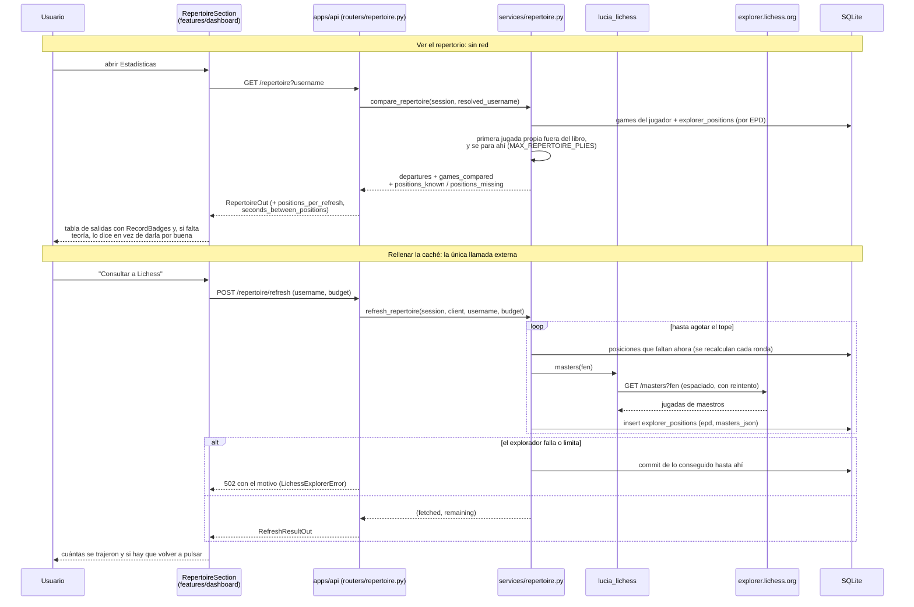

### Deducir patrones del análisis guardado (RF-2.8 · RF-3.2 · RF-3.4 · RF-3.5 · RF-3.7, implementado)

Los patrones no se persisten ni vuelven a llamar al motor: se deducen al leer,
sobre lo que el análisis ya guardó ([ADR-0008](adr/0008-patrones-deducidos-al-leer.md)).
El núcleo (`lucia_core.insights`) solo ve `MoveContext`; quien lee SQLite y los
construye es `services/insights.py`. En las tendencias (RF-3.7) el reparto es
el mismo: el núcleo compara tramos sin saber de qué tamaño son y quien decide
que el tramo es el mes natural —y quien le pega el rating de cierre, que sale
de `games` y no del análisis— es `services/stats.py`. Las reglas y umbrales
concretos están en [02-requerimientos.md § RF-2 y RF-3](02-requerimientos.md).

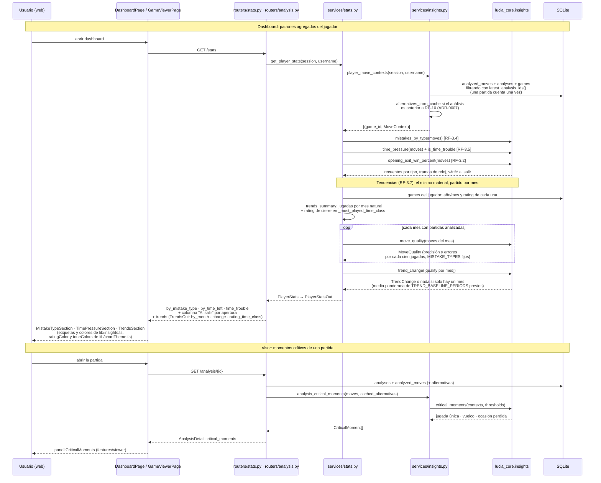

## 4 · Ubicación por requerimiento

Tabla de cruce: requerimiento → dónde vive → qué doc lo explica en detalle. Se
amplía a medida que se implementa cada RF (ver [05-roadmap.md](05-roadmap.md)).

| Requerimiento | Módulo / archivo | Doc detallada |
| --- | --- | --- |
| RF-1 · Importación chess.com | `packages/chesscom/lucia_chesscom/` (cliente, PGN, sync incremental), `apps/api/lucia_api/services/chesscom_sync.py` (que además fija `opening_eco`/`opening_name` con `lucia_core.openings.opening_of_pgn`), `db/models.py`, `routers/sync.py` | [03-arquitectura.md § chesscom](03-arquitectura.md) |
| RF-1.5 · Importar un PGN de otra fuente (OTB, lichess) | `apps/api/lucia_api/routers/pgn_import.py` (`POST /import/pgn`, multipart con `python-multipart`, tope `MAX_PGN_BYTES`), `apps/api/lucia_api/services/pgn_import.py` (`import_pgn`, `PgnImportSummary`; reutiliza `lucia_core.openings.opening_of_pgn` y `lucia_chesscom.parse_move_clocks`, y escribe en `games`/`players` con `platform="manual"`, sin columna ni migración nuevas), `services/games.py` (`"draw"` en `DRAW_RESULTS`), `apps/web/src/lib/api.ts` (`api.importPgn`), `apps/web/src/features/games/GamesPage.tsx` (formulario "Importar PGN", junto a Sincronizar), `apps/web/src/lib/format.ts` (`formatRating`, y los huecos de `formatTimeClass`/`formatTimeControl`) | [ADR-0011](adr/0011-pgn-manual-en-la-misma-tabla.md), [02-requerimientos.md § RF-1](02-requerimientos.md), [03-arquitectura.md § flujo 6](03-arquitectura.md) |
| RF-2 · Análisis con motores | `packages/core/lucia_core/` (engine, `analysis/` con `EngineLine` y el MultiPV completo en `PositionEval.lines`, classification, accuracy), `apps/api/lucia_api/services/analysis.py`, `worker/`, `routers/analysis.py` | [03-arquitectura.md § core / api](03-arquitectura.md) |
| RF-2.2 · Categoría "Libro" | `packages/core/lucia_core/openings/__init__.py` (`Opening`, `default_book`, `GameOpening`, `identify_opening`, `opening_of_pgn`) con la tabla `openings/data/openings.tsv` generada por `scripts/build-openings-table.py`, `packages/core/lucia_core/classification/__init__.py` (`classify_move(..., in_opening_book=...)` → `"book"`), `packages/core/lucia_core/analysis/__init__.py` (`book_plies`), `apps/web/src/lib/classification.ts` (etiqueta "Teoría" y su `description`, que usa el resumen de jugadas del visor) | [ADR-0009](adr/0009-tabla-de-aperturas-versionada.md), [02-requerimientos.md § RF-2](02-requerimientos.md) |
| RF-2.6 · Lc0 y discrepancias | `apps/api/lucia_api/services/comparison.py`, `apps/web/src/features/viewer/EngineComparison.tsx` | [05-roadmap.md § fase 2](05-roadmap.md) |
| RF-2.8 · Momentos críticos | `packages/core/lucia_core/insights/__init__.py` (`MoveContext`, `InsightThresholds`, `CriticalMoment`, `critical_moments`), `apps/api/lucia_api/services/insights.py` (`analysis_critical_moments`, sobre el análisis ya guardado), `routers/analysis.py` (`AnalysisDetail.critical_moments`), `apps/web/src/features/viewer/CriticalMoments.tsx` + `apps/web/src/lib/insights.ts` (`criticalMomentStyle`) | [ADR-0008](adr/0008-patrones-deducidos-al-leer.md), [02-requerimientos.md § RF-2](02-requerimientos.md) |
| RF-3.1-3.3 · Dashboard | `apps/api/lucia_api/services/stats.py` + `routers/stats.py` (cada partida cuenta una vez, con `latest_analysis_ids` de `services/insights.py`), `packages/core/lucia_core/phases/`, `apps/web/src/features/dashboard/` (tablas con `components/DataTable.tsx`, gráficos con la paleta de `lib/chartTheme.ts`); la tabla de aperturas es RF-3.2 y agrupa por `Game.opening_eco` / `Game.opening_name` —la apertura propia de `lucia_core.openings`, ya no la URL de chess.com—, con columna ECO en `apps/web/src/features/dashboard/DashboardPage.tsx` y `OpeningStatsOut.eco` en `routers/stats.py`; la columna "Al salir" sale de `lucia_core.insights.opening_exit_win_percent` y `services/stats.py::_opening_exit_by_opening` | [03-arquitectura.md](03-arquitectura.md), [02-requerimientos.md § RF-3](02-requerimientos.md) |
| RF-3.4 · Distribución de errores por tipo | `packages/core/lucia_core/insights/__init__.py` (`mistake_type`, `mistakes_by_type`), `apps/api/lucia_api/services/stats.py` (`by_mistake_type`) + `routers/stats.py`, `apps/web/src/features/dashboard/DashboardPage.tsx` (`MistakeTypeSection`) con las etiquetas de `apps/web/src/lib/insights.ts` (`mistakeTypeStyle`) | [ADR-0008](adr/0008-patrones-deducidos-al-leer.md), [02-requerimientos.md § RF-3](02-requerimientos.md) |
| RF-3.5 · Gestión del tiempo y *time trouble* | `packages/core/lucia_core/insights/__init__.py` (`time_pressure`, `is_time_trouble`, `TimeBucketStats`), `apps/api/lucia_api/services/stats.py` (`by_time_left`, `time_trouble`, con los relojes de `Game.clocks_json`) + `routers/stats.py`, `apps/web/src/features/dashboard/DashboardPage.tsx` (`TimePressureSection`, tramos con `formatTimeLeftBucket` de `lib/insights.ts`) | [ADR-0008](adr/0008-patrones-deducidos-al-leer.md), [02-requerimientos.md § RF-3](02-requerimientos.md) |
| RF-3.6 · Repertorio contra la teoría de maestros | `packages/lichess/lucia_lichess/` (`LichessExplorerClient.masters`, `ExplorerPosition`), `apps/api/lucia_api/services/repertoire.py` (`compare_repertoire` sin red, `refresh_repertoire` con tope por llamada), `routers/repertoire.py` (`GET /repertoire`, `POST /repertoire/refresh`), `apps/api/lucia_api/db/models.py` (`ExplorerPositionCache`, tabla `explorer_positions`, migración `apps/api/migrations/versions/b4e8c17f0a92_agrega_cache_del_opening_explorer.py`), `apps/web/src/features/dashboard/RepertoireSection.tsx` (con `components/RecordBadges.tsx`) | [ADR-0010](adr/0010-repertorio-con-red-y-cacheado.md), [02-requerimientos.md § RF-3](02-requerimientos.md) |
| RF-3.7 · Tendencias temporales | `packages/core/lucia_core/insights/__init__.py` (`move_quality`, `trend_change`, con `MoveQuality`, `MistakeRate`, `TrendChange`, `MISTAKE_TYPES` y `TREND_BASELINE_PERIODS`: el núcleo compara tramos sin saber de qué tamaño son), `apps/api/lucia_api/services/stats.py` (`_trends_summary`, `TrendsSummary`, `MonthlyQuality`, `_most_played_time_class`: aquí el tramo se concreta en mes natural y se le pega el rating de cierre, leído de `games`), `routers/stats.py` (`TrendsOut` con `MonthlyQualityOut`, `MistakeRateOut` y `TrendChangeOut`, colgado de `PlayerStatsOut.trends` en `GET /stats`: sin endpoint, tabla ni migración nuevos), `apps/web/src/features/dashboard/DashboardPage.tsx` (`TrendsSection`, "Cómo evolucionas") con `apps/web/src/lib/insights.ts` (`formatTrendSentence`), `lib/format.ts` (`formatPerHundredMoves`) y `lib/chartTheme.ts` (`ratingColor`, `toneColors`) | [ADR-0008](adr/0008-patrones-deducidos-al-leer.md), [02-requerimientos.md § RF-3](02-requerimientos.md), [05-roadmap.md § fase 2](05-roadmap.md) |
| RF-3.8 · Rivales recurrentes | pendiente (fase 2) | [05-roadmap.md § fase 2](05-roadmap.md) |
| Lectura de patrones sin persistirlos | `apps/api/lucia_api/services/insights.py` (`latest_analysis_ids` —que desde RF-6.9 deja fuera los análisis de tablero, `game_id` nulo; los de un tablero publicado como partida propia sí lo llevan, RF-6.5—, `player_move_contexts`, `analysis_critical_moments`): traduce filas de `analyzed_moves` a `MoveContext` para que `lucia_core.insights` no sepa de SQLite ni vuelva a llamar al motor | [ADR-0008](adr/0008-patrones-deducidos-al-leer.md) |
| RF-4 · Entrenamiento | pendiente (fase 3) | [05-roadmap.md](05-roadmap.md) |
| RF-5.1 · Visor de partida | `apps/web/src/features/viewer/` (`GameViewerPage`, con `parsePgn` sacando de ahí la posición inicial de la partida; `MoveList`, `EvalChart`); el seguimiento del análisis en curso ya no vive aquí: es `apps/web/src/lib/useTrackedAnalysis.ts` (`useTrackedAnalysis`, `useElapsedSeconds`), compartido con el tablero desde RF-6.9; la numeración de las jugadas sale de `apps/web/src/lib/moves.ts` y los colores del gráfico de `lib/chartTheme.ts`; tablero, barra, botón de jugada (`MoveButton`), lista de líneas del motor (`EngineLineList`) y navegación —con `useMoveNavigationKeys`— se importan de `apps/web/src/components/board/` | [03-arquitectura.md § web](03-arquitectura.md) |
| RF-5.2 · Análisis en vivo y flechas del motor | entregado en el tablero de análisis y, desde RF-10.2, con flechas múltiples y previsualización también en el visor (sobre el análisis guardado, sin llamar al motor); "explorar variantes desde el visor" lo cubre RF-6.6 ("Abrir como tablero", fila RF-6). `apps/api/lucia_api/routers/analysis.py` (`POST /analysis/position`) + `services/analysis.py::analyze_position`; `apps/web/src/components/board/` (`boardConfig.ts` con `arrowsFromEngineLines` y `arrowsFromPreviewLine`, `EvalBar.tsx`, `Chessboard.tsx` con la prop `engineArrows`, `BoardWithEvalBar.tsx`); con qué motor se pide lo elige `apps/web/src/components/EngineSelect.tsx` en las dos pantallas | [03-arquitectura.md § flujo 3](03-arquitectura.md) |
| RF-5.3 · Listado de partidas con filtros | `apps/api/lucia_api/routers/games.py` (nueve filtros: `username`, `color`, `result`, `opponent`, `opening`, `since`, `until`, `time_class`, `rated`, con `_filter_conditions` compartido entre la página y el conteo, y la cabecera `X-Total-Count`), `apps/api/lucia_api/services/games.py` (el lado del jugador en SQL, compartido con `services/stats.py`), `apps/web/src/features/games/GamesPage.tsx` (tabla con `components/DataTable.tsx`, campos con `components/FilterBar.tsx` y `components/FieldLabel.tsx`, total en `lib/api.ts::GamePage`) | [02-requerimientos.md § RF-5](02-requerimientos.md) (reglas de los filtros), [03-arquitectura.md](03-arquitectura.md) |
| RF-5.4 · Config. de motores | `apps/api/lucia_api/routers/engines.py` + `services/engines.py`, `apps/web/src/features/engines/` | [03-arquitectura.md](03-arquitectura.md) |
| RF-5.5 · Exportar una partida analizada a PGN anotado | `apps/api/lucia_api/services/pgn_export.py` (`export_annotated_pgn`, `CLASSIFICATION_COMMENT_LABELS`, `CLASSIFICATION_NAGS`, `MAX_VARIATION_PLIES`; reutiliza `services/analysis.py::engine_lines_from_serialized` y `alternatives_of`, sin llamar al motor), `apps/api/lucia_api/routers/analysis.py` (`GET /analysis/{analysis_id}/pgn`: 409 si el análisis no está en `done`, `application/x-chess-pgn` como descarga con `_pgn_download_filename`, y el cargador `_load_analysis_with_moves` que comparte con `GET /analysis/{id}`), `apps/web/src/lib/api.ts` (`analysisPgnUrl`), `apps/web/src/features/viewer/GameViewerPage.tsx` (enlace "Exportar PGN anotado", un `<a download>` y no un `fetch`) | [03-arquitectura.md § flujo 7](03-arquitectura.md), [02-requerimientos.md § RF-5](02-requerimientos.md), [ADR-0007](adr/0007-alternativas-por-jugada-json-y-cache.md) (de dónde salen las variantes) |
| RF-5.6 · Tema claro/oscuro | `apps/web/src/components/ThemeToggle.tsx` | [02-requerimientos.md § RF-5](02-requerimientos.md) |
| Contrato API ↔ front | `scripts/export-openapi.py`, `openapi.json`, `packages/shared-types/` | [03-arquitectura.md § api](03-arquitectura.md) |
| RF-6 · Tablero de análisis | `apps/api/lucia_api/routers/boards.py`, `apps/web/src/features/board/` (`tree.ts` = árbol de variantes, numerado desde la raíz real del tablero con `plyFromFen` de `apps/web/src/lib/moves.ts`, RF-6.3; `EngineLines.tsx` = los estados del motor en vivo, con las líneas de `components/board/EngineLineList.tsx`, previsualización de línea y `playLine` de `BoardPage.tsx` para jugarla hasta la jugada pulsada, RF-6.2); tablero, barra, flechas, botón de jugada y navegación se importan de `apps/web/src/components/board/`. RF-6 está entregado de punta a punta: la última pieza que faltaba, que un tablero marcado como "partida propia" cuente en estadísticas y patrones, es RF-6.5 (fila propia) | [03-arquitectura.md § web](03-arquitectura.md), [05-roadmap.md § fase 2](05-roadmap.md) |
| RF-6.1 · Las cuatro formas de empezar un tablero (posición inicial, FEN, PGN pegado y editor de posición) | `apps/web/src/features/board/BoardsPage.tsx` (`parseSource`, la única puerta de creación: campo "FEN o PGN" y `POST /boards`), y el editor pieza a pieza son `apps/web/src/features/board/position.ts` (`EditablePosition`, `toFen`, `fromFen`, `enPassantSquares`, `positionError`, `STANDARD_STARTING_FEN` —que `tree.ts` también importa—, `CASTLING_FLAGS`, `FILES`, `RANKS`: lógica pura, con `__tests__/position.test.ts`; el modelo no es un `Chess` de chess.js porque la posición a medio montar es ilegal y no se carga, y al final se valida con `validateFen` más la comprobación propia de jaque del bando que no mueve) y `apps/web/src/features/board/PositionEditor.tsx` (`PositionEditor`, `PaletteButton` y `SquareKeyboardGrid` —una rejilla de 64 botones superpuesta al tablero con `pointer-events-none`, porque chessground no es accesible por teclado—), sobre el modo `editable` de `apps/web/src/components/board/Chessboard.tsx` (`onPositionChange`, `onSelectSquare`, `onReady`) y la clase `.piece-palette` de `apps/web/src/index.css`. Sin endpoint, tabla ni migración: el editor no habla con la API, escribe el FEN en el campo que ya existía | [02-requerimientos.md § RF-6](02-requerimientos.md), [03-arquitectura.md § web](03-arquitectura.md), [07-coherencia-ui.md](07-coherencia-ui.md) (fila 83: el teclado sobre chessground) |
| RF-6.5 · Un tablero marcado como "partida propia" cuenta en estadísticas y patrones | `apps/api/lucia_api/services/own_games.py` (`OwnGameDetails`, `publish_board_as_own_game`, `unpublish_own_game`, `refresh_own_game_moves`, `link_analyses_to_own_game`, `get_own_game`, `get_own_game_with_details`, `BOARD_PLATFORM="board"`, `_build_pgn_with_headers`; reutiliza `services/pgn_import.py::get_or_create_player` y `SIDE_RESULTS_BY_PGN_RESULT` —la misma puerta que RF-1.5— y `lucia_core.openings.opening_of_pgn`), `apps/api/lucia_api/db/models.py` (`Board.own_game_id`, FK a `games` con `SET NULL`, en sustitución de la columna booleana `is_own_game`, que queda como propiedad derivada `own_game_id is not None`; migración `apps/api/migrations/versions/a71c40f5d3e8_tablero_propio_publicado_como_partida.py`), `apps/api/lucia_api/routers/boards.py` (`PUT /boards/{id}/own-game` y `DELETE`, `OwnGamePublishRequest`, `OwnGameLink` en `BoardDetail`, `_follow_own_game_to` tras undo/redo, que arrastra la partida publicada con el PGN de la versión restaurada, `BoardUpdate.pgn` obligatorio en `PUT /boards/{id}` si el tablero está publicado y cambian las jugadas, y `unpublish_own_game` al borrar el tablero), `apps/web/src/features/board/OwnGamePanel.tsx` (`OwnGamePanel`, `OwnGameStatus`) usado por `apps/web/src/features/board/BoardPage.tsx` (que manda el `pgn` de `toPgn` en cada guardado y ya no republica tras deshacer/rehacer), `apps/web/src/lib/api.ts` (`publishOwnGame`, `withdrawOwnGame`). `services/stats.py` y `services/insights.py` **no cambian**: la partida publicada entra por `latest_analysis_ids` como cualquier otra, porque su análisis lleva `game_id` además de `board_id` | [ADR-0014](adr/0014-tablero-propio-publicado-como-partida.md), [02-requerimientos.md § RF-6](02-requerimientos.md), [03-arquitectura.md § flujos principales](03-arquitectura.md) |
| RF-6.6 · Abrir una partida "como tablero de análisis" (copia desacoplada) | `apps/web/src/features/viewer/GameViewerPage.tsx` (`openAsBoardMutation`: pide `api.getAnalysisPgn` si hay análisis en `done` y usa el PGN crudo de la partida si no; la copia nace sin publicar —ya no manda campo alguno de partida propia, publicarla es un paso aparte, RF-6.5), `apps/web/src/lib/api.ts` (`getAnalysisPgn`, el mismo `GET /analysis/{id}/pgn` que RF-5.5 sirve como descarga), `apps/web/src/lib/format.ts` (`formatBoardTitleFromGame`), `apps/web/src/features/board/tree.ts` (`fromPgn`). Cubre también el "explorar variantes desde el visor" de RF-5.2. Sin endpoint, tabla ni migración nuevos | [03-arquitectura.md § flujo 8](03-arquitectura.md), [02-requerimientos.md § RF-6](02-requerimientos.md) |
| RF-6.7 · Importar/exportar el tablero como PGN con variantes y comentarios | exportar ya estaba (`toPgn` en `apps/web/src/features/board/tree.ts`); importar es `fromPgn` en ese mismo módulo (`ParsedPgn` con `headers` y `truncatedBranches`, `splitHeadersAndMovetext`, `tokenizeMovetext`/`PgnToken`, `parseVariation`, `skipToVariationEnd` y `findOrCreateChild`, extraído para compartirlo con `addMove`), porque quien sabe si una jugada es legal es chess.js —`loadPgn` de chess.js descarta variantes y comentarios, de ahí el lector propio—; el panel "Importar PGN" está en `apps/web/src/features/board/BoardPage.tsx` (`importPgnMutation`, `pgnToImport`: sustituye el árbol y renombra el tablero con `formatBoardTitleFromPgnHeaders` de `apps/web/src/lib/format.ts`) y el mismo lector alimenta la creación desde un PGN pegado en `apps/web/src/features/board/BoardsPage.tsx` (`parseSource`, RF-6.1), para que el mismo archivo no dé dos tableros distintos; `apps/api/lucia_api/routers/boards.py` acepta `root_fen` en `BoardUpdate`, validado con `_validate_fen` | [03-arquitectura.md § flujo 8](03-arquitectura.md), [02-requerimientos.md § RF-6](02-requerimientos.md) |
| RF-6.8 · Autoguardado y deshacer/rehacer | autoguardado con retardo en `apps/web/src/features/board/BoardPage.tsx` (`scheduleSave`, `AUTOSAVE_DELAY_MS`, `saveState`) desde RF-6.4/6.5; el historial es `apps/api/lucia_api/db/models.py` (`BoardVersion`, tabla `board_versions`, y el cursor `Board.current_version_id` —sin `ForeignKey` a propósito—, migración `apps/api/migrations/versions/97d2b0821d2b_agrega_board_versions_deshacer_y_rehacer.py`), `apps/api/lucia_api/services/boards.py` (`record_version` —que guarda también el `pgn` de la versión, migración `apps/api/migrations/versions/d4b7e0c25a19_board_versions_guardan_su_pgn.py`—, `restore_previous_version` y `restore_next_version`, que devuelven la `BoardVersion` restaurada para que el router arrastre con ella la partida publicada de RF-6.5, `can_undo`, `can_redo`, `MAX_VERSIONS_PER_BOARD`), `apps/api/lucia_api/routers/boards.py` (`POST /boards/{id}/undo` y `/redo` con 409 cuando no hay adónde ir, `can_undo`/`can_redo` en `BoardDetail` vía `_board_detail`, y `_get_board` compartido; `PUT /boards/{id}` anota versión solo si cambia `tree_json` o `root_fen`), `apps/web/src/features/board/useUndoRedoKeys.ts` (Ctrl+Z · Ctrl+Y · Ctrl+Mayús+Z) y `apps/web/src/features/board/BoardPage.tsx` (`historyMutation`, `flushPendingSave` antes de pedir, `treeFromBoard` y `cacheBoard` para dejar en pantalla lo que respondió el servidor), `apps/web/src/lib/api.ts` (`undoBoard`, `redoBoard`) | [ADR-0012](adr/0012-historial-de-tablero-lineal-y-persistido.md), [03-arquitectura.md § flujo 9](03-arquitectura.md), [02-requerimientos.md § RF-6](02-requerimientos.md) |
| RF-6.9 · Análisis completo del tablero en background | `apps/api/lucia_api/db/models.py` (`Analysis.board_id` y `Analysis.analyzed_pgn`, con `game_id` ya nullable: una fila cuelga de una partida o de un tablero; migración `apps/api/migrations/versions/5ce9943fe2dc_analyses_tambien_sobre_tableros.py`), `apps/api/lucia_api/services/analysis.py` (`run_analysis(session, analysis, pgn, ...)`: recibe el PGN y no un `Game`), `apps/api/lucia_api/worker/__init__.py` (`AnalysisWorker._load_pgn_to_analyze`, el único punto que distingue el origen), `apps/api/lucia_api/routers/boards.py` (`BoardAnalysisRequest`, `analyze_board` → `POST /boards/{id}/analysis`, misma cola y mismo `AnalysisSummary`; si el tablero está publicado como partida propia, el `Analysis` nace además con `game_id`, RF-6.5), `apps/api/lucia_api/services/insights.py` (`latest_analysis_ids` exige `game_id` no nulo: un tablero no cuenta en estadísticas ni patrones salvo que esté publicado como partida propia, RF-6.5), `apps/web/src/lib/useTrackedAnalysis.ts` (`useTrackedAnalysis`, `useElapsedSeconds`, compartidos con el visor), `apps/web/src/features/board/tree.ts` (`matchAnalyzedLine`: hasta dónde sigue valiendo lo analizado tras seguir editando), `apps/web/src/features/board/VariationTree.tsx` (`analyzedByNodeId`), `apps/web/src/features/board/BoardPage.tsx` (`analyzeBoardMutation`), `apps/web/src/lib/api.ts` (`analyzeBoard`, `listAnalyses({gameId, boardId})`) | [ADR-0013](adr/0013-analisis-de-partida-o-de-tablero.md), [03-arquitectura.md § flujo 2](03-arquitectura.md), [02-requerimientos.md § RF-6](02-requerimientos.md) |
| RF-7 · Ocupación del tablero | pendiente (fase 2/4) | [02-requerimientos.md § RF-7](02-requerimientos.md) |
| RF-10.1-10.2 · Alternativas por jugada en el análisis guardado | `packages/core/lucia_core/analysis/__init__.py` (`EngineLine`, `PositionEval.lines`, `AnalyzedMove.alternatives`), `apps/api/lucia_api/db/models.py` (`AnalyzedMove.alternatives_json`, migración `apps/api/migrations/versions/7a1c4e9d2b30_agrega_alternatives_json_a_analyzed_moves.py`), `services/analysis.py` (`_engine_lines`, `engine_lines_from_serialized`, `alternatives_from_cache`), `routers/analysis.py` (`AnalyzedMoveOut.alternatives`), `apps/web/src/features/viewer/GameViewerPage.tsx` + `apps/web/src/components/board/EngineLineList.tsx`. RF-10.3 (usarlas en los puzzles) sigue pendiente con RF-4.1 | [ADR-0007](adr/0007-alternativas-por-jugada-json-y-cache.md), [02-requerimientos.md § RF-10](02-requerimientos.md) |
| RF-8 · Personalización de interfaz | pendiente (Post 1.0, fase 5) | [02-requerimientos.md § RF-8](02-requerimientos.md) |
| RF-9 · Comparación entre motores (tabla y flechas) | pendiente (Post 1.0); amplía lo que hoy hace `services/comparison.py` + `EngineComparison.tsx` | [02-requerimientos.md § RF-9](02-requerimientos.md) |
| RF-11 · Partidas con ventaja (odds) contra el motor | pendiente (Post 1.0, fase 6); analizar una partida con ventaja ya funciona, porque `services/analysis.py::run_analysis` parte de la posición del PGN — falta jugarla | [02-requerimientos.md § RF-11](02-requerimientos.md), [05-roadmap.md § fase 6](05-roadmap.md) |
| Posición de partida no estándar (odds, Chess960, posición dada) | `apps/api/lucia_api/db/models.py` (`Game.starts_from_custom_position`, derivado del PGN: sin columna ni migración) expuesto por `routers/games.py` en `GameSummary`/`GameDetail`; lo avisa `apps/web/src/components/CustomPositionBadge.tsx` en listado, visor y tableros; al analizar lo respeta `apps/api/lucia_api/services/analysis.py::run_analysis` | [03-arquitectura.md § api y flujo 2](03-arquitectura.md) |
| RNF-11 · Coherencia de interfaz | transversal a `apps/web/`: lo compartido vive en `apps/web/src/components/` (`Button.tsx`, `Panel.tsx`, `Feedback.tsx`, `DataTable.tsx`, `EngineSelect.tsx`, `FilterBar.tsx` (barra de filtros de listado y dashboard, con la espera al teclear), `FieldLabel.tsx` (la etiqueta de campo de la barra, Sincronizar, `BoardsPage` y `EnginesPage`) y `RecordBadges.tsx` (el marcador V/T/D de las tablas de control de tiempo, apertura y salidas de la teoría), `Badge.tsx` con sus dos usos con significado `ClassificationBadge.tsx` y `CustomPositionBadge.tsx`, `styles.ts` con las recetas de clases y las medidas comunes, y las piezas de tablero en `components/board/`, incluidos `MoveButton.tsx`, `EngineLineList.tsx` y `useMoveNavigationKeys.ts`) y en `apps/web/src/lib/` lo que debe dar el mismo resultado en todas las pantallas (`format.ts`, `score.ts`, `classification.ts`, `moves.ts`, `chartTheme.ts` (desde RF-3.7, con `toneColors`: un color de gráfico por tono de `Badge`, para que un tipo de error se reconozca igual en la tabla y en la serie), `insights.ts` con las etiquetas y colores de tipos de error y momentos críticos, que comparten dashboard y visor); inventariado en su [README](../apps/web/src/components/README.md); criterios C-1 a C-7, inventario de incumplimientos vacío: las 63 filas que llegó a tener están cerradas | [07-coherencia-ui.md](07-coherencia-ui.md) |
| Destinos externos y su ritmo | `packages/chesscom/lucia_chesscom/` (importación, fuera de la sesión de uso) y `packages/lichess/lucia_lichess/` (Opening Explorer, el único que se consulta mientras se usa la aplicación: espaciado entre consultas, reintento y tope por llamada desde `routers/repertoire.py`) | [ADR-0010](adr/0010-repertorio-con-red-y-cacheado.md), [04-stack-tecnologico.md](04-stack-tecnologico.md) |
| Motores UCI | `engines/`, `scripts/setup-engines.sh` | [ADR-0002](adr/0002-motores-como-submodulos.md) |
| Tabla de aperturas versionada | `packages/core/lucia_core/openings/data/openings.tsv` (3.810 posiciones, generadas desde chess-openings de Lichess, CC0) + `scripts/build-openings-table.py`; la carga cacheada es `default_book()`; la columna en BD la añade `apps/api/migrations/versions/9c2d51ab7e04_agrega_apertura_propia_a_games.py`, que rellena también las partidas ya importadas | [ADR-0009](adr/0009-tabla-de-aperturas-versionada.md) |
| Persistencia | `apps/api/lucia_api/db/` | [ADR-0005](adr/0005-sqlite-local-first.md) |
| Probabilidad de victoria (win%) | `packages/core/lucia_core/accuracy/__init__.py` (backend) y `apps/web/src/lib/score.ts` (`whiteWinPercentFromScore`, cliente) | [ADR-0006](adr/0006-probabilidad-de-victoria-en-el-cliente.md) |
| Orquestación nativa (`make up`) | `scripts/dev.sh`, `scripts/doctor.sh` | [README.md § arranque rápido](../README.md) |

*Filas "pendiente" se completan cuando el módulo exista de verdad; el
`mapeador` no inventa rutas de código que no están escritas.*
