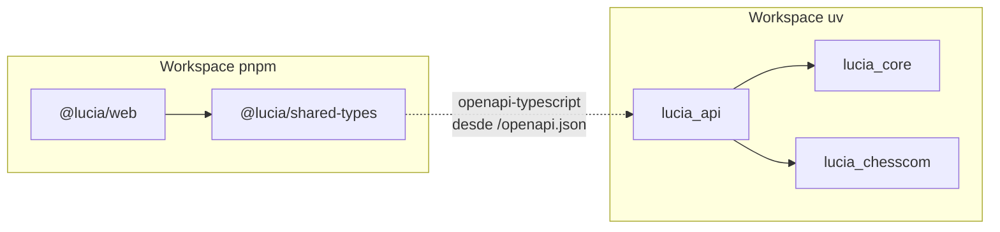
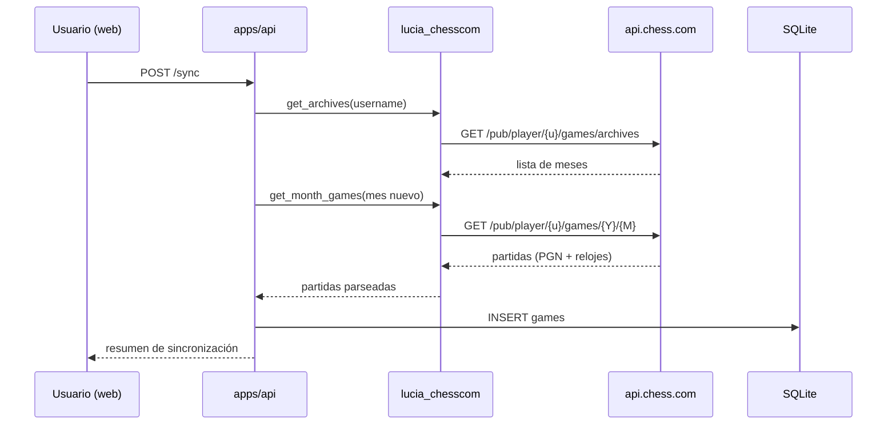
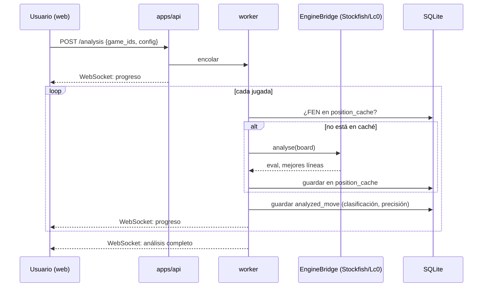

# 06 · Mapa del proyecto

Este documento es el mapa vivo de LUCIA: dónde vive cada cosa, cómo se conecta y
qué requerimiento o decisión la justifica. Sirve para dos lectores distintos:

- **Personas**, para orientarse rápido sin leer todo el repo antes de tocar algo.
- **IA (agentes de Claude Code)**, como referencia de consulta antes de un cambio:
  qué módulo toca, con qué otros habla, y qué doc detallada corresponde.

Lo mantiene actualizado el agente **`mapeador`**, y es un **cruce** del trabajo de
los otros tres agentes de calidad del proyecto: toma los nombres que fija
`bautizador`, la estructura que deja `minimalista` tras simplificar, y los
RF/RNF/ADR que registra `documentador`, y los refleja aquí. No repite la
narrativa de [03-arquitectura.md](03-arquitectura.md) ni de
[02-requerimientos.md](02-requerimientos.md); apunta a ellas.

> Si un diagrama de aquí contradice el código actual, el código manda: es señal
> de que el mapeador necesita pasar. Ver [CLAUDE.md](../CLAUDE.md).

## 1 · Flujo general

Detalle narrativo y modelo de datos completo: [03-arquitectura.md](03-arquitectura.md).

## 2 · Módulos y dependencias

Regla: `lucia_core` y `lucia_chesscom` no dependen de `lucia_api` (evita ciclos);
`lucia_api` orquesta a ambos. Si un cambio rompe esta dirección, es una señal
para el agente `minimalista`.

## 3 · Flujos principales

### Sincronizar con chess.com (RF-1)

### Analizar una partida (RF-2)

## 4 · Ubicación por requerimiento

Tabla de cruce: requerimiento → dónde vive → qué doc lo explica en detalle. Se
amplía a medida que se implementa cada RF (ver [05-roadmap.md](05-roadmap.md)).

| Requerimiento | Módulo / archivo | Doc detallada |
| --- | --- | --- |
| RF-1 · Importación chess.com | `packages/chesscom/lucia_chesscom/client.py` | [03-arquitectura.md § chesscom](03-arquitectura.md) |
| RF-2 · Análisis con motores | `packages/core/lucia_core/engine/`, `analysis/`, `classification/`, `accuracy/` | [03-arquitectura.md § core](03-arquitectura.md) |
| RF-3 · Estadísticas e insight | `packages/core/lucia_core/insights/`, `apps/api/lucia_api/routers/stats.py` (pendiente) | [03-arquitectura.md](03-arquitectura.md) |
| RF-4 · Entrenamiento | pendiente (fase 3) | [05-roadmap.md](05-roadmap.md) |
| RF-5 · Interfaz / visor | `apps/web/src/features/viewer/` | [04-stack-tecnologico.md § frontend](04-stack-tecnologico.md) |
| RF-6 · Tablero de análisis | pendiente (fase 1-2) | [02-requerimientos.md § RF-6](02-requerimientos.md) |
| RF-7 · Ocupación del tablero | pendiente (fase 2/4) | [02-requerimientos.md § RF-7](02-requerimientos.md) |
| Motores UCI | `engines/`, `scripts/setup-engines.sh` | [ADR-0002](adr/0002-motores-como-submodulos.md) |
| Persistencia | `apps/api/lucia_api/db/` | [ADR-0005](adr/0005-sqlite-local-first.md) |
| Orquestación nativa (`make up`) | `scripts/dev.sh`, `scripts/doctor.sh` | [README.md § arranque rápido](../README.md) |

*Filas "pendiente" se completan cuando el módulo exista de verdad; el
`mapeador` no inventa rutas de código que no están escritas.*
