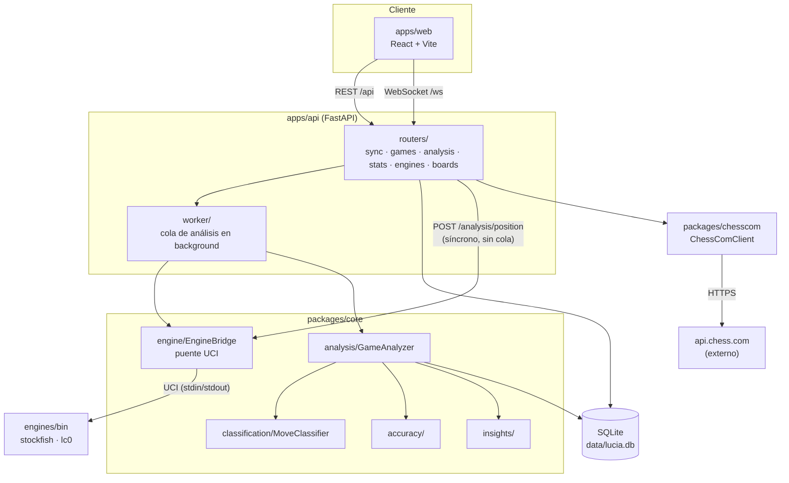
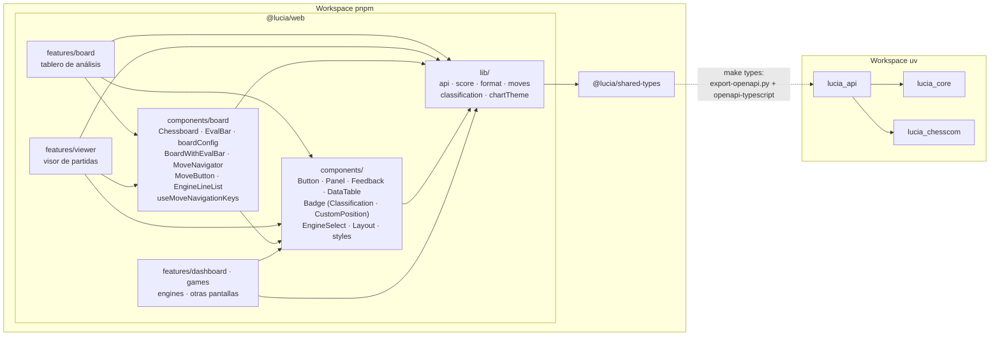
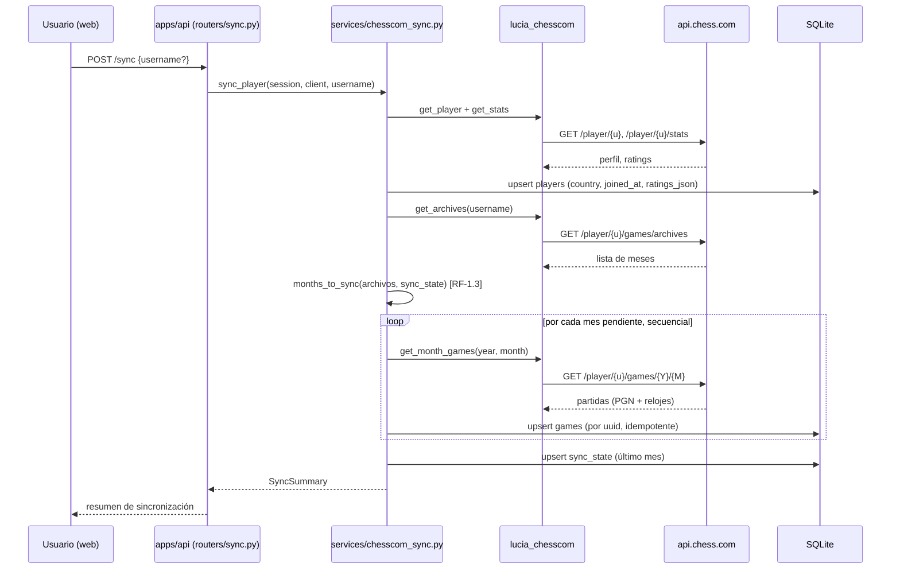
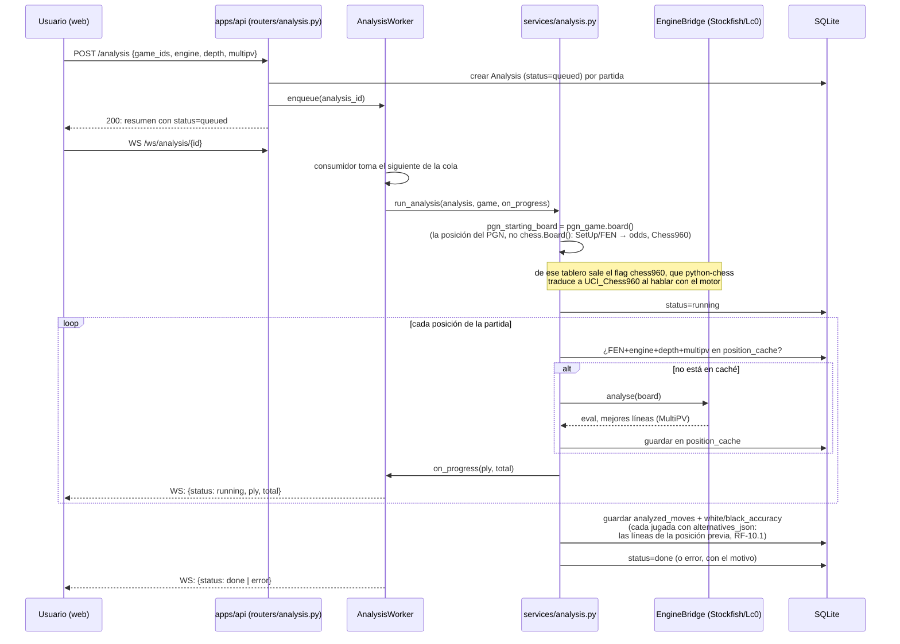
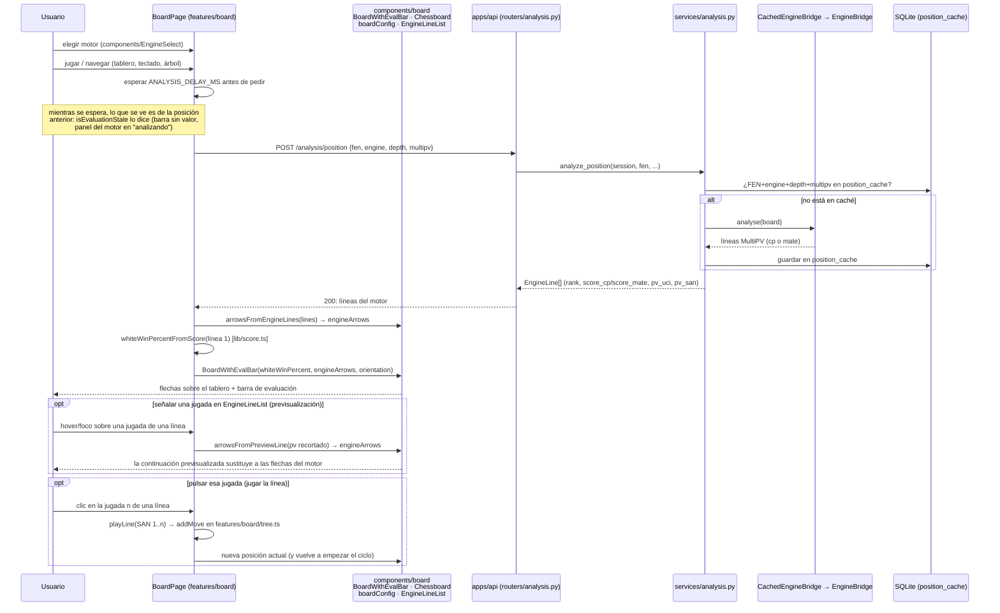
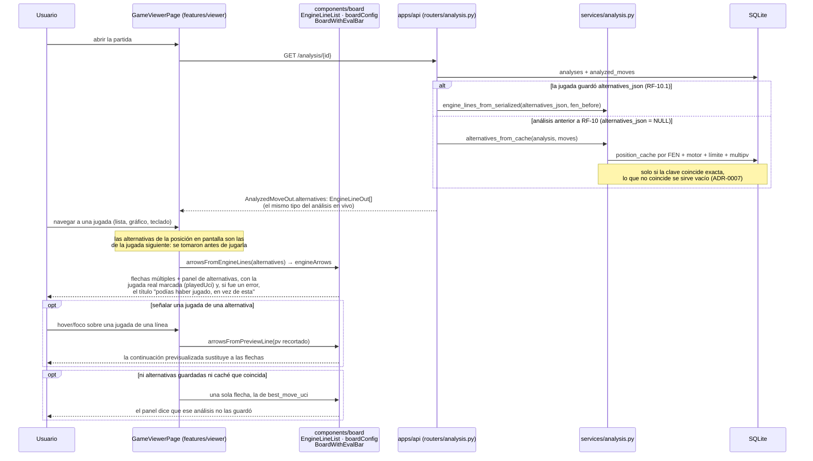

# 06 · Mapa del proyecto

Este documento es el mapa vivo de LUCIA: dónde vive cada cosa, cómo se conecta y
qué requerimiento o decisión la justifica. Sirve para dos lectores distintos:

- **Personas**, para orientarse rápido sin leer todo el repo antes de tocar algo.
- **IA (agentes de Claude Code)**, como referencia de consulta antes de un cambio:
  qué módulo toca, con qué otros habla, y qué doc detallada corresponde.

Lo mantiene actualizado el agente **`mapeador`**, y es un **cruce** del trabajo de
los demás agentes de calidad del proyecto: toma los nombres que fija
`bautizador`, la estructura que deja `minimalista` tras simplificar, y los
RF/RNF/ADR que registra `documentador`, y los refleja aquí. No repite la
narrativa de [03-arquitectura.md](03-arquitectura.md), de
[02-requerimientos.md](02-requerimientos.md) ni de
[07-coherencia-ui.md](07-coherencia-ui.md) (criterios de interfaz, del agente
`coherencia-ui`); apunta a ellas.

> Si un diagrama de aquí contradice el código actual, el código manda: es señal
> de que el mapeador necesita pasar. Ver [CLAUDE.md](../CLAUDE.md).

## 1 · Flujo general

Detalle narrativo y modelo de datos completo: [03-arquitectura.md](03-arquitectura.md).

## 2 · Módulos y dependencias

Regla: `lucia_core` y `lucia_chesscom` no dependen de `lucia_api` (evita ciclos);
`lucia_api` orquesta a ambos. Si un cambio rompe esta dirección, es una señal
para el agente `minimalista`.

Dentro de `@lucia/web` la dirección también es de una sola vía: las pantallas
(`features/*`) importan de `components/` —lo compartido entre dos o más de
ellas—, nunca al revés. Las piezas de tablero que usan el visor y el tablero de
análisis viven en `components/board/` —desde RF-10, también `EngineLineList`, la
lista de líneas del motor que comparten los dos—; el resto de lo común (botón,
panel, estados, recetas de clases), en `components/`. Si un componente de
`components/` empieza a importar de un `features/`, es que no era compartido y
su sitio es esa pantalla. Sí puede apoyarse en `lib/` —funciones puras y hooks
sin pantalla: `EngineSelect` usa `format.ts`, `ClassificationBadge` usa
`classification.ts`—, que es la capa de abajo de todos. Inventario:
[apps/web/src/components/README.md](../apps/web/src/components/README.md).

## 3 · Flujos principales

### Sincronizar con chess.com (RF-1, implementado)

### Analizar una partida (RF-2, implementado)

`GET /analysis/{id}` es el respaldo si no hubo WebSocket conectado o se
perdió algún evento (hay una ventana de carrera pequeña y documentada entre
suscribirse y el estado real, ver docstring de `analysis_progress`), y es
también donde se rellenan las alternativas de los análisis anteriores a RF-10,
leyéndolas de `position_cache` con `alternatives_from_cache`
([ADR-0007](adr/0007-alternativas-por-jugada-json-y-cache.md)).

### Analizar una posición en vivo (RF-5.2 / RF-6.2, implementado)

Flujo 3 de [03-arquitectura.md § Flujos principales](03-arquitectura.md): no
hay fila `Analysis` ni cola, la petición es síncrona y el cliente es quien
traduce la evaluación a probabilidad de victoria ([ADR-0006](adr/0006-probabilidad-de-victoria-en-el-cliente.md)).

### Ver las alternativas de una jugada guardada (RF-10, implementado)

En el visor la fuente es distinta: no llama al motor, pinta el análisis ya
guardado. Desde RF-10 ese análisis trae todas las líneas de cada posición, así
que el visor dibuja las mismas flechas y la misma lista que el tablero de
análisis sin pedir nada más.

A diferencia del tablero de análisis, aquí pulsar una jugada de una línea solo
la dibuja: no hay `onPlayLine`, porque una partida terminada no se continúa.

## 4 · Ubicación por requerimiento

Tabla de cruce: requerimiento → dónde vive → qué doc lo explica en detalle. Se
amplía a medida que se implementa cada RF (ver [05-roadmap.md](05-roadmap.md)).

| Requerimiento | Módulo / archivo | Doc detallada |
| --- | --- | --- |
| RF-1 · Importación chess.com | `packages/chesscom/lucia_chesscom/` (cliente, PGN, sync incremental), `apps/api/lucia_api/services/chesscom_sync.py`, `db/models.py`, `routers/sync.py` | [03-arquitectura.md § chesscom](03-arquitectura.md) |
| RF-2 · Análisis con motores | `packages/core/lucia_core/` (engine, `analysis/` con `EngineLine` y el MultiPV completo en `PositionEval.lines`, classification, accuracy), `apps/api/lucia_api/services/analysis.py`, `worker/`, `routers/analysis.py` | [03-arquitectura.md § core / api](03-arquitectura.md) |
| RF-2.6 · Lc0 y discrepancias | `apps/api/lucia_api/services/comparison.py`, `apps/web/src/features/viewer/EngineComparison.tsx` | [05-roadmap.md § fase 2](05-roadmap.md) |
| RF-3.1-3.3 · Dashboard | `apps/api/lucia_api/services/stats.py` + `routers/stats.py`, `packages/core/lucia_core/phases/`, `apps/web/src/features/dashboard/` (tablas con `components/DataTable.tsx`, gráficos con la paleta de `lib/chartTheme.ts`) | [03-arquitectura.md](03-arquitectura.md) |
| RF-3.4+ · Insight avanzado | `packages/core/lucia_core/insights/` (pendiente, fase 2) | [05-roadmap.md](05-roadmap.md) |
| RF-4 · Entrenamiento | pendiente (fase 3) | [05-roadmap.md](05-roadmap.md) |
| RF-5.1 · Visor de partida | `apps/web/src/features/viewer/` (`GameViewerPage`, con `parsePgn` sacando de ahí la posición inicial de la partida; `MoveList`, `EvalChart`, `useAnalysisProgress`); la numeración de las jugadas sale de `apps/web/src/lib/moves.ts` y los colores del gráfico de `lib/chartTheme.ts`; tablero, barra, botón de jugada (`MoveButton`), lista de líneas del motor (`EngineLineList`) y navegación —con `useMoveNavigationKeys`— se importan de `apps/web/src/components/board/` | [03-arquitectura.md § web](03-arquitectura.md) |
| RF-5.2 · Análisis en vivo y flechas del motor | entregado en el tablero de análisis y, desde RF-10.2, con flechas múltiples y previsualización también en el visor (sobre el análisis guardado, sin llamar al motor); queda RF-6.6 (fase 2). `apps/api/lucia_api/routers/analysis.py` (`POST /analysis/position`) + `services/analysis.py::analyze_position`; `apps/web/src/components/board/` (`boardConfig.ts` con `arrowsFromEngineLines` y `arrowsFromPreviewLine`, `EvalBar.tsx`, `Chessboard.tsx` con la prop `engineArrows`, `BoardWithEvalBar.tsx`); con qué motor se pide lo elige `apps/web/src/components/EngineSelect.tsx` en las dos pantallas | [03-arquitectura.md § flujo 3](03-arquitectura.md) |
| RF-5.3 · Listado de partidas | `apps/api/lucia_api/routers/games.py`, `apps/web/src/features/games/` (tabla con `components/DataTable.tsx`) | [03-arquitectura.md](03-arquitectura.md) |
| RF-5.4 · Config. de motores | `apps/api/lucia_api/routers/engines.py` + `services/engines.py`, `apps/web/src/features/engines/` | [03-arquitectura.md](03-arquitectura.md) |
| RF-5.6 · Tema claro/oscuro | `apps/web/src/components/ThemeToggle.tsx` | [02-requerimientos.md § RF-5](02-requerimientos.md) |
| Contrato API ↔ front | `scripts/export-openapi.py`, `openapi.json`, `packages/shared-types/` | [03-arquitectura.md § api](03-arquitectura.md) |
| RF-6 · Tablero de análisis | `apps/api/lucia_api/routers/boards.py`, `apps/web/src/features/board/` (`tree.ts` = árbol de variantes, numerado desde la raíz real del tablero con `plyFromFen` de `apps/web/src/lib/moves.ts`, RF-6.3; `EngineLines.tsx` = los estados del motor en vivo, con las líneas de `components/board/EngineLineList.tsx`, previsualización de línea y `playLine` de `BoardPage.tsx` para jugarla hasta la jugada pulsada, RF-6.2); tablero, barra, flechas, botón de jugada y navegación se importan de `apps/web/src/components/board/` | [03-arquitectura.md § web](03-arquitectura.md) |
| RF-7 · Ocupación del tablero | pendiente (fase 2/4) | [02-requerimientos.md § RF-7](02-requerimientos.md) |
| RF-10.1-10.2 · Alternativas por jugada en el análisis guardado | `packages/core/lucia_core/analysis/__init__.py` (`EngineLine`, `PositionEval.lines`, `AnalyzedMove.alternatives`), `apps/api/lucia_api/db/models.py` (`AnalyzedMove.alternatives_json`, migración `apps/api/migrations/versions/7a1c4e9d2b30_agrega_alternatives_json_a_analyzed_moves.py`), `services/analysis.py` (`_engine_lines`, `engine_lines_from_serialized`, `alternatives_from_cache`), `routers/analysis.py` (`AnalyzedMoveOut.alternatives`), `apps/web/src/features/viewer/GameViewerPage.tsx` + `apps/web/src/components/board/EngineLineList.tsx`. RF-10.3 (usarlas en los puzzles) sigue pendiente con RF-4.1 | [ADR-0007](adr/0007-alternativas-por-jugada-json-y-cache.md), [02-requerimientos.md § RF-10](02-requerimientos.md) |
| RF-8 · Personalización de interfaz | pendiente (Post 1.0, fase 5) | [02-requerimientos.md § RF-8](02-requerimientos.md) |
| RF-9 · Comparación entre motores (tabla y flechas) | pendiente (Post 1.0); amplía lo que hoy hace `services/comparison.py` + `EngineComparison.tsx` | [02-requerimientos.md § RF-9](02-requerimientos.md) |
| RF-11 · Partidas con ventaja (odds) contra el motor | pendiente (Post 1.0, fase 6); analizar una partida con ventaja ya funciona, porque `services/analysis.py::run_analysis` parte de la posición del PGN — falta jugarla | [02-requerimientos.md § RF-11](02-requerimientos.md), [05-roadmap.md § fase 6](05-roadmap.md) |
| Posición de partida no estándar (odds, Chess960, posición dada) | `apps/api/lucia_api/db/models.py` (`Game.starts_from_custom_position`, derivado del PGN: sin columna ni migración) expuesto por `routers/games.py` en `GameSummary`/`GameDetail`; lo avisa `apps/web/src/components/CustomPositionBadge.tsx` en listado, visor y tableros; al analizar lo respeta `apps/api/lucia_api/services/analysis.py::run_analysis` | [03-arquitectura.md § api y flujo 2](03-arquitectura.md) |
| RNF-11 · Coherencia de interfaz | transversal a `apps/web/`: lo compartido vive en `apps/web/src/components/` (`Button.tsx`, `Panel.tsx`, `Feedback.tsx`, `DataTable.tsx`, `EngineSelect.tsx`, `Badge.tsx` con sus dos usos con significado `ClassificationBadge.tsx` y `CustomPositionBadge.tsx`, `styles.ts` con las recetas de clases y las medidas comunes, y las piezas de tablero en `components/board/`, incluidos `MoveButton.tsx`, `EngineLineList.tsx` y `useMoveNavigationKeys.ts`) y en `apps/web/src/lib/` lo que debe dar el mismo resultado en todas las pantallas (`format.ts`, `score.ts`, `classification.ts`, `moves.ts`, `chartTheme.ts`); inventariado en su [README](../apps/web/src/components/README.md); criterios C-1 a C-7, inventario de incumplimientos vacío desde el 2026-09-08 | [07-coherencia-ui.md](07-coherencia-ui.md) |
| Motores UCI | `engines/`, `scripts/setup-engines.sh` | [ADR-0002](adr/0002-motores-como-submodulos.md) |
| Persistencia | `apps/api/lucia_api/db/` | [ADR-0005](adr/0005-sqlite-local-first.md) |
| Probabilidad de victoria (win%) | `packages/core/lucia_core/accuracy/__init__.py` (backend) y `apps/web/src/lib/score.ts` (`whiteWinPercentFromScore`, cliente) | [ADR-0006](adr/0006-probabilidad-de-victoria-en-el-cliente.md) |
| Orquestación nativa (`make up`) | `scripts/dev.sh`, `scripts/doctor.sh` | [README.md § arranque rápido](../README.md) |

*Filas "pendiente" se completan cuando el módulo exista de verdad; el
`mapeador` no inventa rutas de código que no están escritas.*
